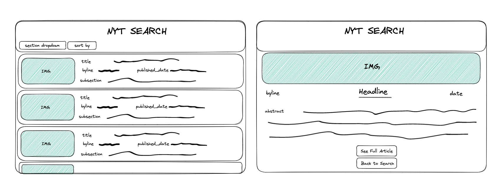

## Summary

This project was the result of a take-home challenge as part of Turing School of Software & Design's curriculum. We were given a New York Times API to consume and roughly two days to complete our task. 

Requirements included:
  * Displaying a list of articles
  * Displaying a “detailed” view for each article (as opposed to summary/list view)
  * Articles in the list must link to the detailed article view you create
  * Some sort of search, filter, OR sort
   
All other design was left up to us. I started with a basic wireframe, but did end up veering off from it a bit as I got further into the challenge and decided that I would like to tweak that design. I decided to implement Bootstrap to give it a clean, simple, and intuitive design, although this did end up causing some unexpected time-waste.

Given more time, additional features/fixes I would like to implement include:
  * Cypress testing
  * Formatting dates on the article cards
  * A refined landing page
  * Error handling
  * Loading animations

## Installation

1. Fork and clone the repo to your local machine.
2. CD into repo and open in your code editor.
3. Install packages.
    ```zsh
    npm i
    ```
4. Start the application.
    ```zsh
    npm start
    ```
## Wireframe



## Built With


